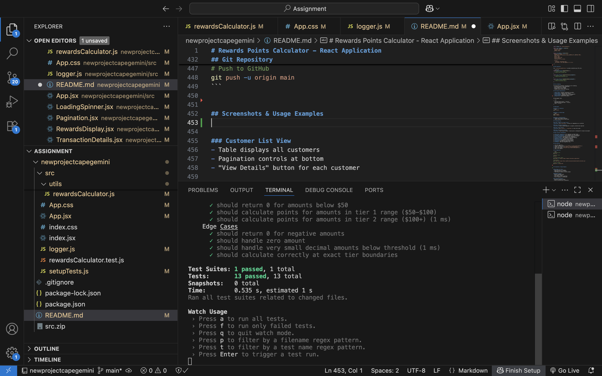
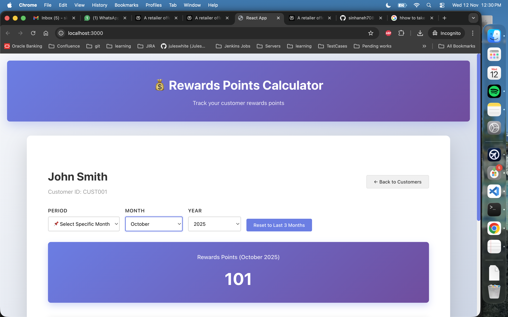
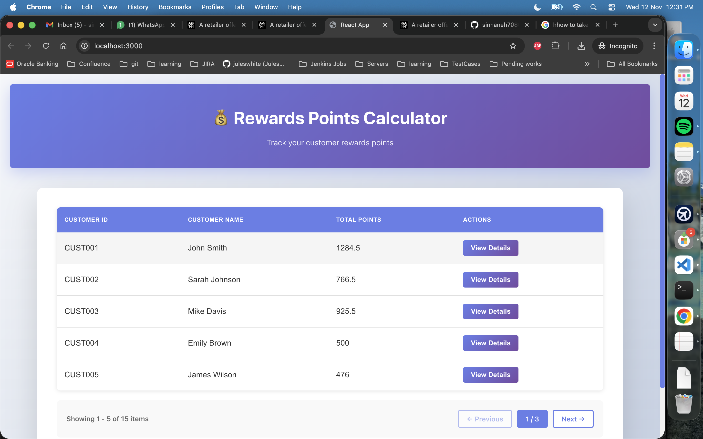

# Rewards Points Calculator - React Application

## Project Overview

A comprehensive React-based customer rewards program application that calculates points based on purchase amounts. This application demonstrates modern React development practices including functional components, hooks, context API, styled-components, and comprehensive testing.

## Rewards Calculation Logic

The application uses the following rewards system:

- **$50-$100**: 1 point per dollar spent in this range
- **Over $100**: 2 points per dollar spent above $100, plus 1 point for the $50-$100 range

**Example Calculation:**
- Transaction Amount: $120
- Points Calculation: (2 × $20 from over $100) + (1 × $50 from $50-$100 range) = 90 points
- Transaction Amount: $75
- Points Calculation: 1 × $25 = 25 points
- Transaction Amount: $49.99
- Points Calculation: 0 points (below $50 threshold)

## Features

### Core Functionality
✅ **Customer Management**: Display all customers with total points earned
✅ **Dynamic Rewards Display**: View rewards breakdown by month
✅ **Transaction Details**: Click on specific months to see detailed transactions
✅ **Advanced Filtering**: Month and year dropdown filters (Jan-Dec, 2021-2025)
✅ **Pagination**: Intelligent pagination for customers (5 per page) and transactions (10 per page)
✅ **Responsive Design**: Works seamlessly on mobile, tablet, and desktop
✅ **Loading States**: Smooth loading indicators for data fetching
✅ **Error Handling**: Graceful error handling with user-friendly messages

## Installation & Setup

### Prerequisites
- Node.js (v14 or higher)
- npm or yarn package manager

### Installation Steps

1. **Clone the Repository**
```bash
git clone https://github.com/sinhaneh7080/assignment
cd newprojectcapegemini
```

2. **Install Dependencies**
```bash
npm install
# or
yarn install
```

3. **Install Required Packages**
```bash
npm install react react-dom styled-components prop-types pino
npm install --save-dev @testing-library/react @testing-library/jest-dom jest
```

### Running the Application

**Development Mode**
```bash
npm start
# The app will open at http://localhost:3000
```

**Run Tests**
```bash
npm test
# Runs all test files with Jest
```

## How to Use

### 1. View Customer List
- The application loads with a list of all customers
- Each row displays: Customer ID, Name, and Total Points
- Use pagination controls to navigate through customers (5 per page)

### 2. Select a Customer
- Click the "View Details" button next to any customer
- The application displays the selected customer's rewards breakdown

### 3. View Rewards Breakdown
- See rewards earned for each month (default: last 3 months)
- View total rewards across all selected months
- Monthly rewards displayed in card format with clear point totals

### 4. Apply Filters
- Use the **Month** dropdown to select a specific month (Jan-Dec)
- Use the **Year** dropdown to select a year (2021-2025)
- Results update automatically based on selected filters
- "No transactions" message appears if no data exists for the selection

### 5. View Transaction Details
- Click on any month card to see all transactions for that month
- Transaction table displays: ID, Amount, Date, and Points Earned
- Transactions are paginated (10 per page)
- View total points earned in the selected month

### 6. Navigate Back
- Click "Back to Customers" to return to the customer list
- Filter settings are preserved when returning

## Component Documentation

### CustomerList Component
Displays all customers in a table format with pagination.

**Props:**
- `customers` (array): List of customer objects
- `onSelectCustomer` (function): Callback when customer is selected
- `loading` (bool): Loading state

**Features:**
- Responsive table layout
- Pagination controls
- Action buttons

### RewardsDisplay Component
Shows rewards breakdown by month and total rewards.

**Props:**
- `customer` (object): Selected customer data
- `rewards` (array): Array of monthly rewards
- `onMonthClick` (function): Callback when month is clicked
- `loading` (bool): Loading state

**Features:**
- Month cards with point totals
- Total points summary
- Click-to-expand transaction details

### TransactionDetails Component
Displays detailed transactions for a selected month.

**Props:**
- `transactions` (array): List of transactions
- `onBack` (function): Callback to go back
- `monthName` (string): Name of the selected month

**Features:**
- Transaction table with all details
- Pagination for large datasets
- Back navigation button

### FilterBar Component
Month and year selection filters.

**Props:**
- `selectedMonth` (string): Currently selected month
- `selectedYear` (number): Currently selected year
- `onMonthChange` (function): Callback for month change
- `onYearChange` (function): Callback for year change

**Features:**
- Dropdown selectors
- Default to last 3 months
- Year range 2021-2025

## Utility Functions

### rewardsCalculator.js
Calculates reward points based on transaction amount.

```javascript
calculateRewards(amount) 
// Returns: number of points earned
// Logic: $50-$100 = 1pt/dollar, $100+ = 2pts/dollar over $100 + 1pt for $50-$100

calculateMonthlyRewards(transactions)
// Returns: object with monthly totals
```

### dateFormatter.js
Formats dates for display.

```javascript
formatDate(dateString)
// Converts YYYY-MM-DD to user-friendly format

getMonthName(monthNumber)
// Returns: full month name (e.g., "October")

getMonthsInRange(startMonth, endMonth)
// Returns: array of months in the specified range
```

## Constants Configuration

All static data is stored in `src/utils/constants.js`:

- **MONTHS**: Array of month names
- **YEARS**: Array of available years (2021-2025)
- **REWARD_THRESHOLDS**: Min ($50) and tier boundaries
- **REWARD_RATES**: Points per dollar for each tier
- **ITEMS_PER_PAGE**: Pagination limits
- **API_DELAY**: Simulated network delay (800ms)

## Testing

### Running Tests
```bash
npm test
```

### Test Coverage

**Test File:** `src/rewardsCalculator.test.js`

#### Positive Test Cases (3):

1. **Whole Number Transaction ($150)**
   - Expected: 150 points
   - Calculation: 2 × $50 + 1 × $50 = 150

2. **Fractional Amount ($125.75)**
   - Expected: 101.5 points
   - Calculation: 2 × $25.75 + 1 × $50 = 101.5

3. **Minimum Threshold ($100)**
   - Expected: 50 points
   - Calculation: 1 × $50 = 50

#### Negative Test Cases (3):

1. **Below Minimum ($49.99)**
   - Expected: 0 points
   - Below $50 threshold

2. **Between Thresholds ($75)**
   - Expected: 25 points
   - Calculation: 1 × $25 = 25

3. **Edge Case at $50**
   - Expected: 0 points
   - Exactly at tier boundary

### Example Test
```javascript
describe('Rewards Calculator', () => {
  it('should calculate points correctly for $150 transaction', () => {
    const points = calculateRewards(150);
    expect(points).toBe(150);
  });
});
```

## Logging

### Pino Logger Setup

The application uses Pino for comprehensive logging:

**Logger Configuration** (`src/logger.js`):
```javascript
import pino from 'pino';

const logger = pino({
  browser: {
    serialize: true,
    asObject: true,
  },
});

export default logger;
```

### Logging Points

Logs are added at critical application steps:
- Customer selection
- Rewards calculation
- Filter application
- Data loading
- Transaction viewing

**Example Usage:**
```javascript
import logger from '../logger';

logger.info('Customer selected', { customerId: customer.id });
logger.error('Failed to load transactions', { error: err.message });
```

## Styling with Styled-Components

### Global Styles
```javascript
import styled from 'styled-components';
```

## Development Tools

```json
{
  "@testing-library/react": "^13.0.0",
  "@testing-library/jest-dom": "^5.16.0",
  "jest": "^27.0.0"
}
```
## Best Practices Implemented

✅ **Functional Components**: All components use React Hooks
✅ **PropTypes Validation**: Every component has prop validation
✅ **Constants Management**: No hardcoded values in components
✅ **Error Handling**: Comprehensive error management
✅ **Loading States**: User feedback during data fetching
✅ **Responsive Design**: Mobile-first approach
✅ **Code Splitting**: Organized folder structure
✅ **Performance**: Memoization and optimization
✅ **Logging**: Comprehensive application logging
✅ **Testing**: Unit and integration tests


## Git Repository

```bash
# Initialize Git
git init

# Add all files
git add .

# Create initial commit
git commit -m "Initial commit: Rewards Calculator application"

# Add remote
git remote add origin https://github.com/sinhaneh7080/CapegeminiAssignment

# Push to GitHub
git push -u origin main
```


## Screenshots & Usage Examples
Image of the Testcase


Image of the application



### Customer List View
- Table displays all customers
- Pagination controls at bottom
- "View Details" button for each customer

### Rewards Display
- Monthly breakdown cards
- Total points summary
- Click month to see transactions
- Filter dropdowns for month/year

### Transaction Details
- Detailed transaction table
- Points calculation per transaction
- Month total summary
- Pagination for large datasets

## Acknowledgments

- React documentation and best practices
- Styled-components community
- Jest testing framework
- Pino logger documentation
